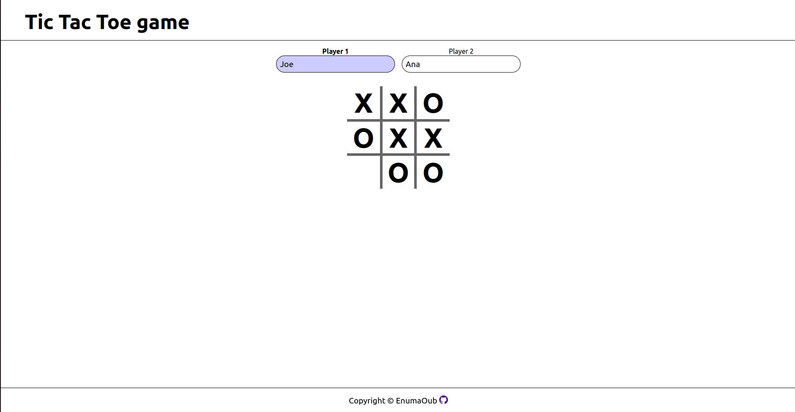
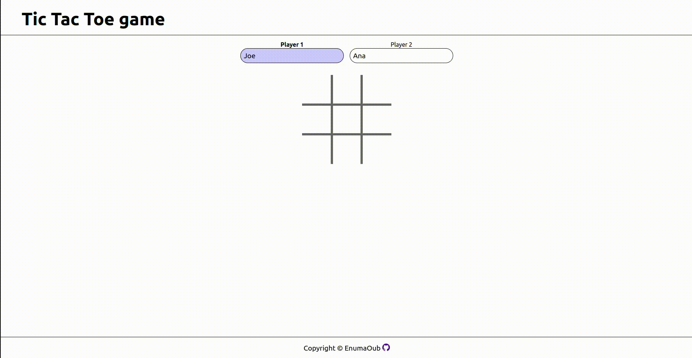

# Tic Tac Toe

## Description
Little project to apply what I've learned of Html, CSS and base of OOP javascript.
Use module Pattern to protect some variable and use factory functions for each parts.

## Working
We have a basic Tic Tac Toe game
